# NYC Taxi ETA Prediction

**Input:** pickup/dropoff coordinates + time of day
**Output:** estimated trip duration in minutes
**Data:** 1.45 million NYC taxi trips (Jan–Jun 2016)
**Result:** LightGBM model, 32% more accurate than a statistical baseline — deployable as a prediction tool via `predict.py`

Built as part of the [Machine Learning for Transport](https://welf.dev/labs/ai-intro) lab series.

---

## What this project does

Given what a taxi dispatcher knows at the moment of pickup — location, destination, and time — the model estimates how long the trip will take.

The full pipeline goes from raw CSV data to a working prediction tool:
1. **Explore** the raw data — distributions, time patterns, coordinate ranges
2. **Clean** invalid trips — GPS errors, impossible durations, out-of-range coordinates
3. **Engineer features** — straight-line distance, bearing, hour, weekday, rush-hour flag
4. **Baseline** — OLS regression establishes what a simple statistical model achieves
5. **Compare models** — Random Forest, Gradient Boosting, LightGBM, XGBoost; tune the best with Optuna; explain with SHAP
6. **Analyse errors** — segment RMSE by distance and time to understand where the model is reliable

---

## Results

### Model comparison

Trained on 1,157,960 trips (Jan–May 2016) · Validated on 289,490 trips (Jun 2016)

| Model | Val RMSE | vs. baseline |
|---|---|---|
| Naive (predict mean) | 0.7446 | — |
| OLS regression | 0.5514 | −26% |
| Random Forest | 0.3839 | −48% |
| Hist. Gradient Boosting | 0.3778 | −49% |
| XGBoost | 0.3765 | −49% |
| LightGBM | 0.3764 | −49% |
| **LightGBM (tuned)** | **0.3758** | **−50%** |

**What is RMSE?** Root Mean Squared Error measures average prediction error. Because the model predicts log(trip duration), an RMSE of 0.3764 means predictions are within roughly ±46% of the actual duration on average. For a 30-minute trip that is a ±14-minute window; for a 10-minute trip, ±5 minutes. Lower is better.

### What this improvement means in practice

The step from a statistical baseline (OLS) to a machine learning model (LightGBM) is not just a number going down — it is a concrete reduction in how wrong the prediction is per trip:

| Model | 10-minute trip | 30-minute trip | 60-minute trip |
|---|---|---|---|
| OLS regression | ±7 min | ±22 min | ±44 min |
| LightGBM | ±5 min | ±14 min | ±28 min |

For a platform dispatching thousands of trips per hour, that difference compounds across three levers:

- **Driver utilisation** — a tighter ETA means a driver can be sent later without the passenger waiting. Idle time at the kerb is paid time with no revenue.
- **Passenger trust** — the gap between the app's promise and the actual arrival is what passengers remember. Cutting that gap from 22 to 14 minutes on a typical trip reduces the most common source of complaints.
- **Fleet planning** — trip duration feeds directly into how many drivers are needed where and when. A 30% error in duration produces a 30% error in estimated fleet load, which leads to either excess supply (expensive) or shortfalls (lost rides).

OLS captures the obvious linear signals — longer distance takes longer, rush hour is slower. LightGBM captures the interactions OLS misses: a long trip during midday in Midtown behaves differently from the same distance on a Sunday morning, and differently again depending on direction. That non-linear nuance is what the 32% error reduction represents.

### Where the model is reliable

| Trip type | RMSE | Interpretation |
|---|---|---|
| Very long trips (> 7 km) | 0.257 | ±29% error — reliable enough for dispatching |
| Long trips (3–7 km) | 0.301 | ±35% error — good |
| Medium trips (1–3 km) | 0.367 | ±44% error — acceptable |
| Short trips (< 1 km) | 0.537 | ±71% error — use with caution |
| Night (0–6 h) | 0.330 | most predictable window |
| Midday (10–16 h) | 0.408 | highest variance — unpredictable traffic mix |

---

## Figures

Generated by `make pipeline`. Figures are not committed — run the pipeline to produce them locally.

### Exploration

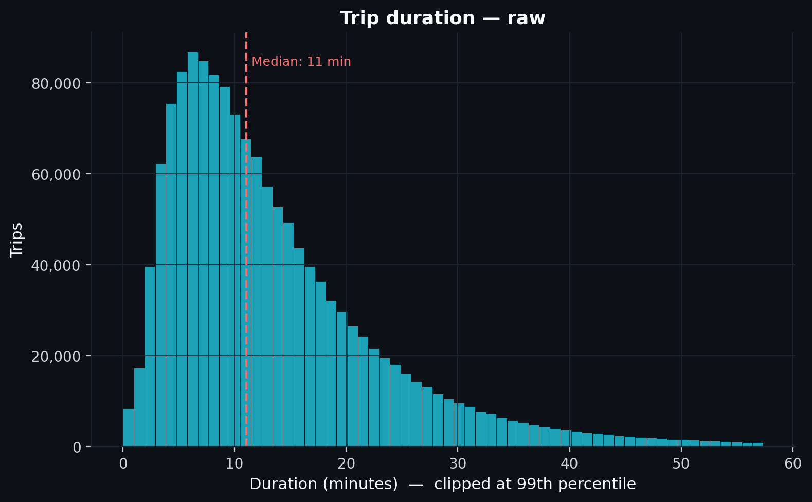
*Raw trip duration in minutes, clipped at the 99th percentile. Right-skewed — a log transform is needed before regression.*

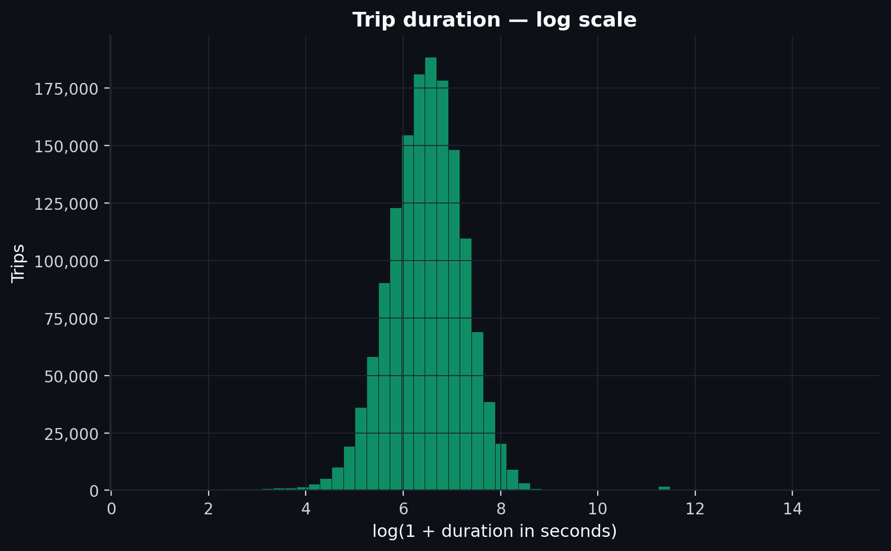
*Log-transformed target. Roughly symmetric — RMSE on this scale is the model's evaluation metric.*

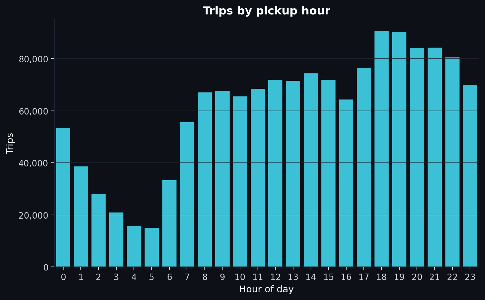
*Clear evening peak at 18–20h — extracted as a feature.*

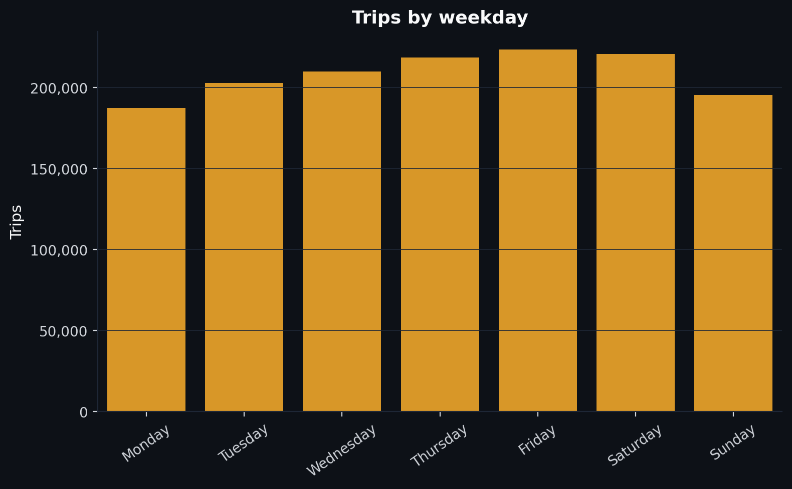
*Friday and Saturday show higher volume. Weekday is extracted as a feature; weekend and rush-hour flags are derived from it.*

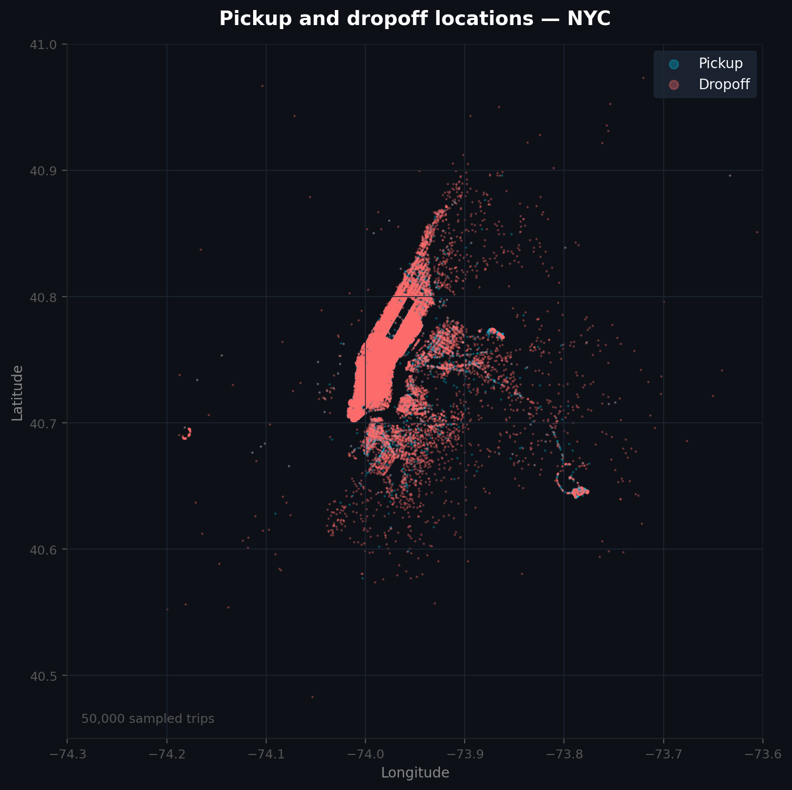
*50 000 sampled trips. Pickups concentrate in Midtown and lower Manhattan; dropoffs spread across all five boroughs.*

---

### Baseline

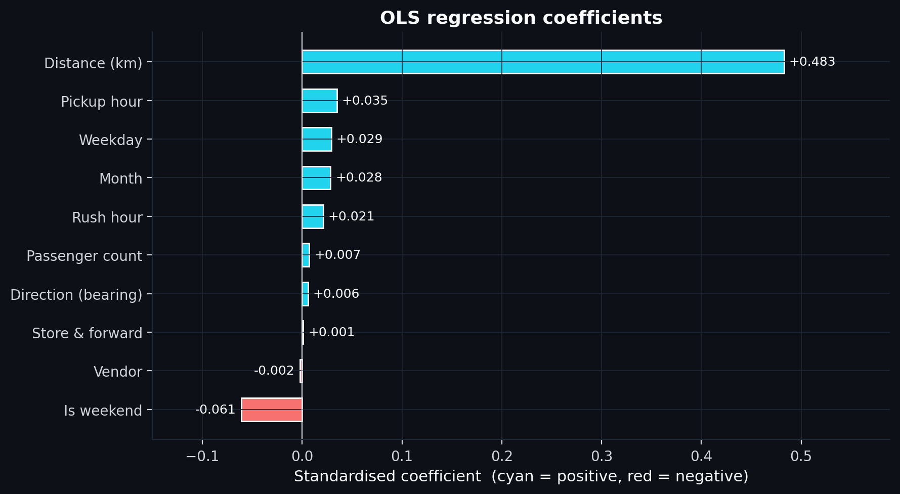
*Standardised OLS coefficients. Distance dominates; time features contribute weakly — their signal is non-linear.*

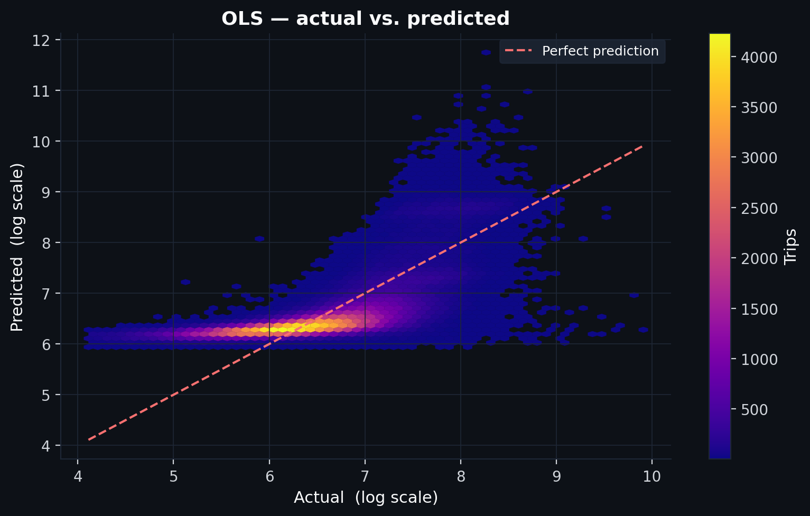
*Actual vs. predicted on the validation set. The fan shape shows structured residual error that tree models will recover.*

---

### Model comparison

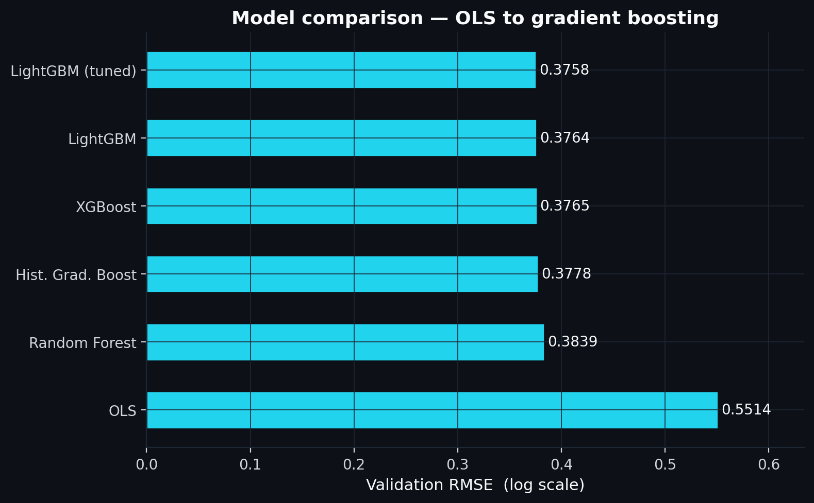
*All models on the same time-ordered 80/20 split. Gradient boosting converges around RMSE 0.376; Optuna tuning pushes past that.*

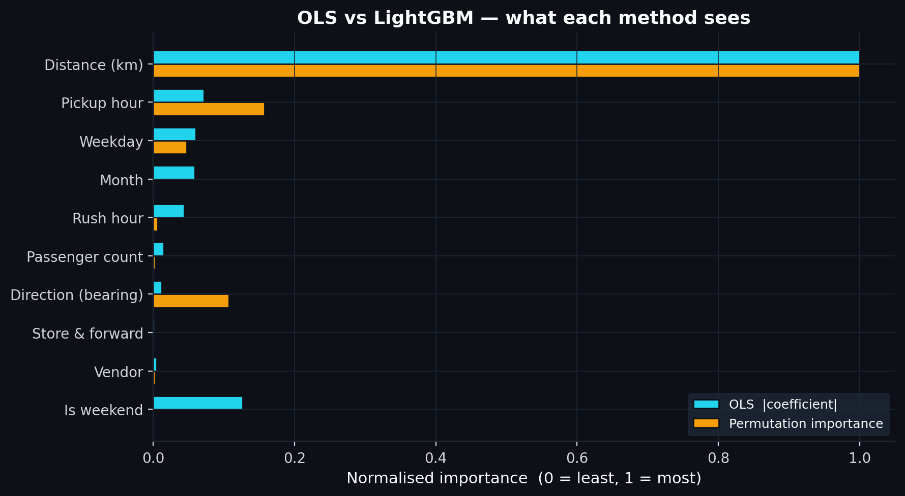
*OLS coefficient magnitude vs. permutation importance, normalised to [0, 1]. Direction (bearing) is near-zero for OLS but meaningful for LightGBM — a non-linear effect the linear model misses entirely.*

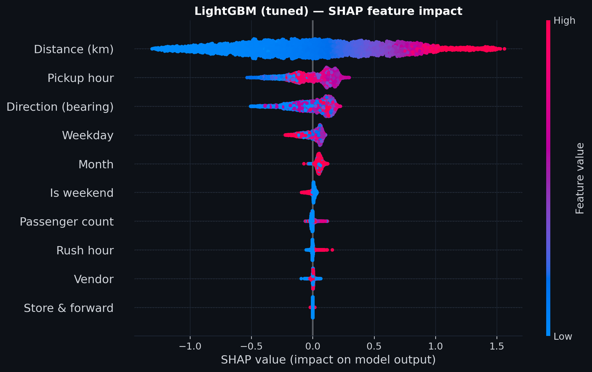
*SHAP beeswarm for LightGBM (tuned). Each dot is one validation trip. Position shows the direction and magnitude of that feature's impact on the prediction; colour shows whether the feature value was high (pink) or low (blue).*

---

### Error analysis

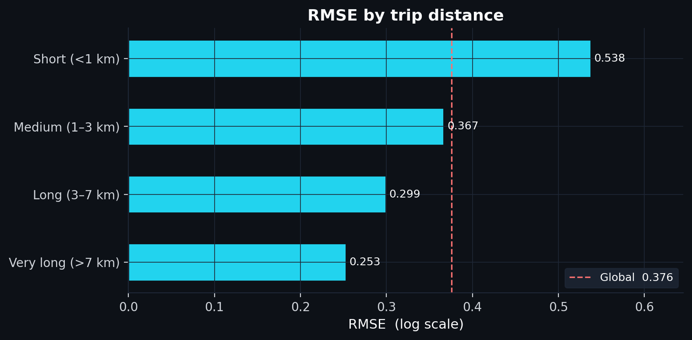
*RMSE by trip distance. Short trips (<1 km) have 43% higher error than average — a single traffic light can double a 3-minute trip.*

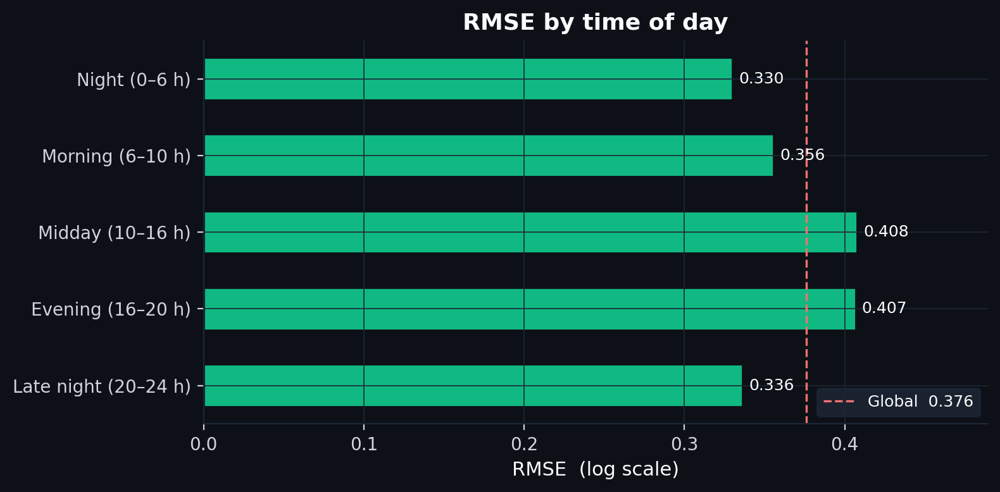
*Night trips are the most predictable; midday the least. Low-traffic nights are consistent; midday mixes unpredictable office, tourist, and delivery flows.*

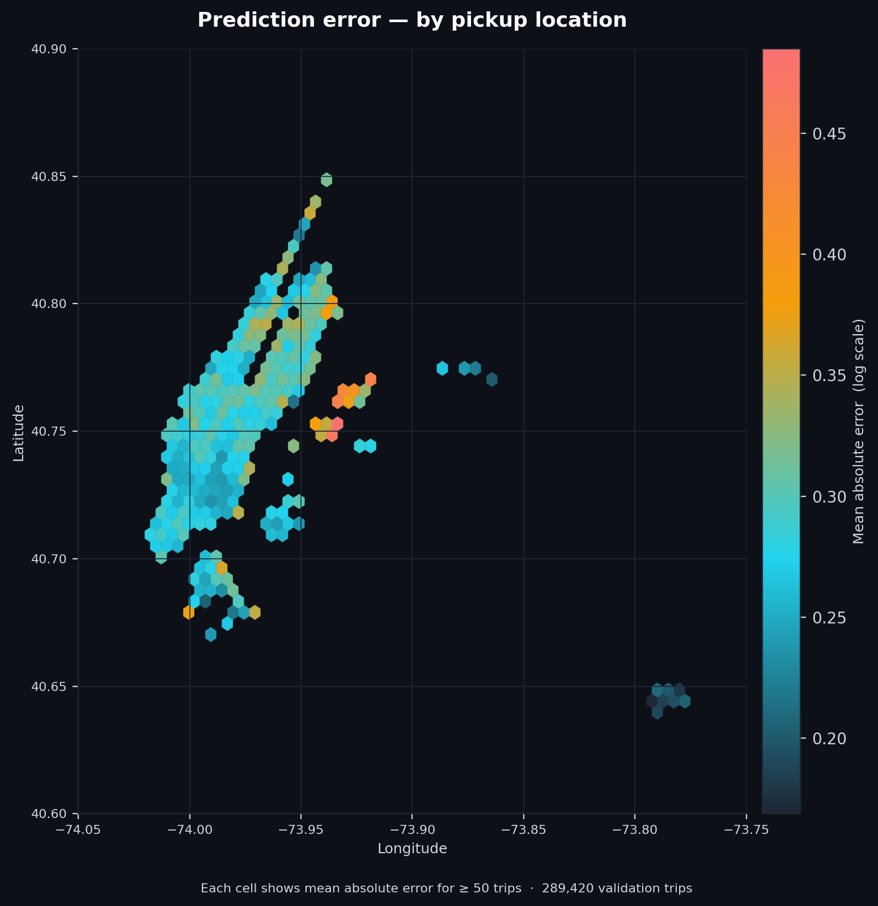
*Mean absolute error per hexbin cell (≥50 trips). Outer-borough edges and airport corridors show elevated error.*

---

## Getting Started

### 1. Get the data

Download the **NYC Taxi Trip Duration** dataset from Kaggle:
[kaggle.com/c/nyc-taxi-trip-duration/data](https://www.kaggle.com/c/nyc-taxi-trip-duration/data)

Place the files in `data/raw/`:
```
data/raw/
├── train.csv
└── test.csv
```

The raw data is not included in this repository — Kaggle's terms of service prohibit redistribution of competition datasets.

### 2. Set up the environment

```bash
make install
```

Creates a `.venv`, upgrades pip, and installs all dependencies from `requirements.txt`.

### 3. Run the full pipeline

```bash
make pipeline
```

Runs all six scripts in order. Outputs: charts in `figures/`, trained model in `models/`.

### 4. Predict a trip

```bash
python predict.py <pickup_lat> <pickup_lon> <dropoff_lat> <dropoff_lon> <hour> <weekday>
```

Arguments: coordinates (decimal degrees), hour (0–23), weekday (0=Monday, 6=Sunday).

```bash
# Midtown Manhattan to JFK Airport, Monday evening rush hour
python predict.py 40.754 -73.984 40.641 -73.778 17 0
```
```
Trip summary
  Distance  : 21.44 km
  Departure : Monday at 17:00
  Estimated : 68.6 minutes
```

Requires `make pipeline` to have been run first.

---

## Project Structure

```
scripts/
  01_data_exploration.py      explore target distribution, locations, time patterns
  02_clean_data.py            remove invalid trips; writes data/processed/train_clean.csv
  03_feature_engineering.py   haversine distance, bearing, time features; writes train_features.csv
  04_baseline_model.py        OLS regression with RMSE evaluation and residual diagnostics
  05_model_comparison.py      train all 5 models; saves best model to models/
  06_error_analysis.py        segment RMSE by distance, time of day, and day type

predict.py                    predict trip duration from coordinates and time
Makefile                      install, pipeline, clean

data/
  raw/                        not included — download from Kaggle
  processed/                  generated by pipeline — gitignored

models/                       saved best model — generated by pipeline — gitignored
figures/                      charts organised by script number — generated by pipeline — gitignored
```

---

## Stack

| Library | Purpose |
|---|---|
| pandas | data loading, cleaning, feature engineering |
| numpy | numeric calculations |
| scikit-learn | OLS, Random Forest, Hist. Gradient Boosting, metrics |
| lightgbm | LightGBM gradient boosting |
| xgboost | XGBoost gradient boosting |
| optuna | hyperparameter search |
| shap | model explainability (SHAP beeswarm) |
| matplotlib / seaborn | charts |
